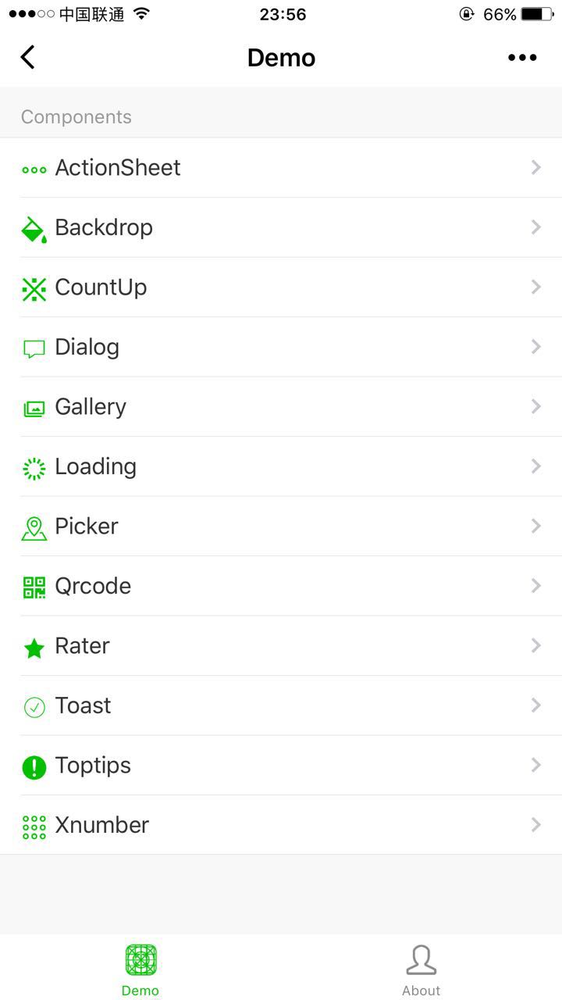

<p align="center">
    <a href="https://wux-weapp.github.io/wux-weapp-docs/">
        
    </a>
</p>

# Wux Weapp

一套组件化、可复用、易扩展的微信小程序 UI 组件库

[](https://www.npmjs.org/package/wux-weapp)

# 快速上手

## 使用之前

在开始使用之前，你需要先阅读 [微信小程序自定义组件](https://developers.weixin.qq.com/miniprogram/dev/framework/custom-component/) 的相关文档。

## 如何使用

1. 通过 `npm` 安装，需要依赖小程序基础库 `2.2.1` 以上版本，同时依赖开发者工具的 `npm` 构建。具体详情可查阅 [官方 npm 文档](https://developers.weixin.qq.com/miniprogram/dev/devtools/npm.html)。
2. 通过 [GitHub](https://github.com/wux-weapp/wux-weapp/) 下载 `Wux Weapp` 的代码，然后 将 `packages/lib/` 目录拷贝到自己的项目中。按照如下的方式使用组件，以 Button 为例，其它组件在对应的文档页查看：

> - `packages/lib/` - 压缩版（ES5）
- `packages/es/` - 未压缩版（ES6，使用时需要开启 `ES6 转 ES5`，位于开发者工具右上角-详情-本地配置）

### 在 page.json 中引入组件

```json
"usingComponents": {
    "wux-button": "../../dist/button/index"
}
```

### 在 page.wxml 中使用组件

```html
<wux-button size="small" />
<wux-button size="default" />
<wux-button size="large" />
```

### 组件库文件体积过大的问题

随着组件库越来越丰富，文件的体积也越来越大，某些时候我们可能只需要其中的一个或多个组件，如果直接引入整个组件库的话是不合适的，这时候就需要我们将要使用到组件给单独抽离出来。

1. 使用 [定制主题](https://wux-weapp.github.io/wux-weapp-docs/#/customize-theme) 功能自动抽离组件（官方推荐）。

2. 手动抽离组件，也很简单直接拷贝 `packages/` 目录下对应的组件即可，当然某些组件存在依赖关系，则抽离过程会相对复杂一些，以 ActionSheet、Badge、Button 为例。

```
demo/
  |-actionsheet/
  |-animation-group/
  |-backdrop/
  |-badge/
  |-button/
  |-helpers/
  |-index.js
```

- 首先将 `packages/` 目录下对应组件（如 `actionsheet`）拷贝至 `demo` 目录；
- 其次看其对应目录下 `index.json` 是否存在依赖组件，若存在则一一拷贝；
- 然后看组件是否依靠 JavaScript 主动调用（查看对应文档可得知或存在 `index.js` 文件中），是则拷贝 `index.js` 文件，并删除不需要的组件引用；
- 最后查看组件目录下 `index.js` 是否存在对帮助方法的引用，若存在则拷贝 `helpers` 目录（抑或直接拷贝不管是否存在引用）。

## 预览

您可以扫描下方的小程序码体验或用 [微信web开发者工具](https://mp.weixin.qq.com/debug/wxadoc/dev/devtools/download.html) 打开 `example` 目录（请注意，是 example 目录，不是整个项目）。




## 相关链接

- [Wux Weapp 源码地址](https://github.com/wux-weapp/wux-weapp/)
- [Wux Weapp 文档地址](https://wux-weapp.github.io/wux-weapp-docs/)
- [Wux Weapp 更新日志](https://wux-weapp.github.io/wux-weapp-docs/#/changelog)
- [Wux Weapp 案例征集](https://github.com/wux-weapp/wux-weapp/issues/123)

## 讨论组

您可以扫码添加下方的小助手微信并备注 Wux Weapp 进交流群。


## 赞助

请作者喝营养快线补补小身体(`・ω・´)

<p>
  
  
</p>

## 案例


## 贡献

有任何意见或建议都欢迎提 issue

## License

MIT
